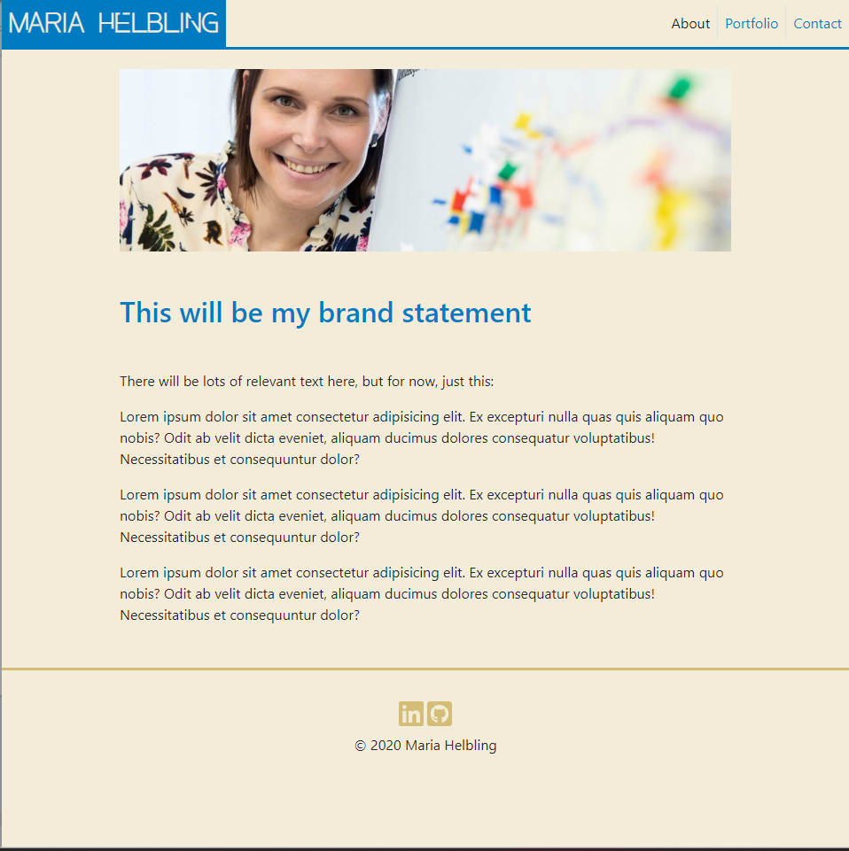
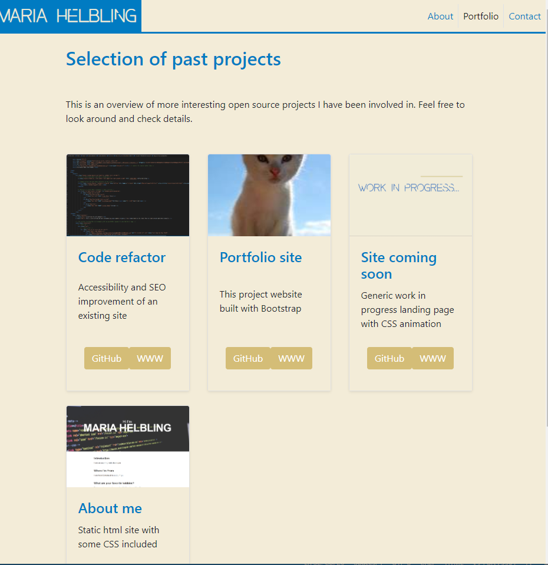
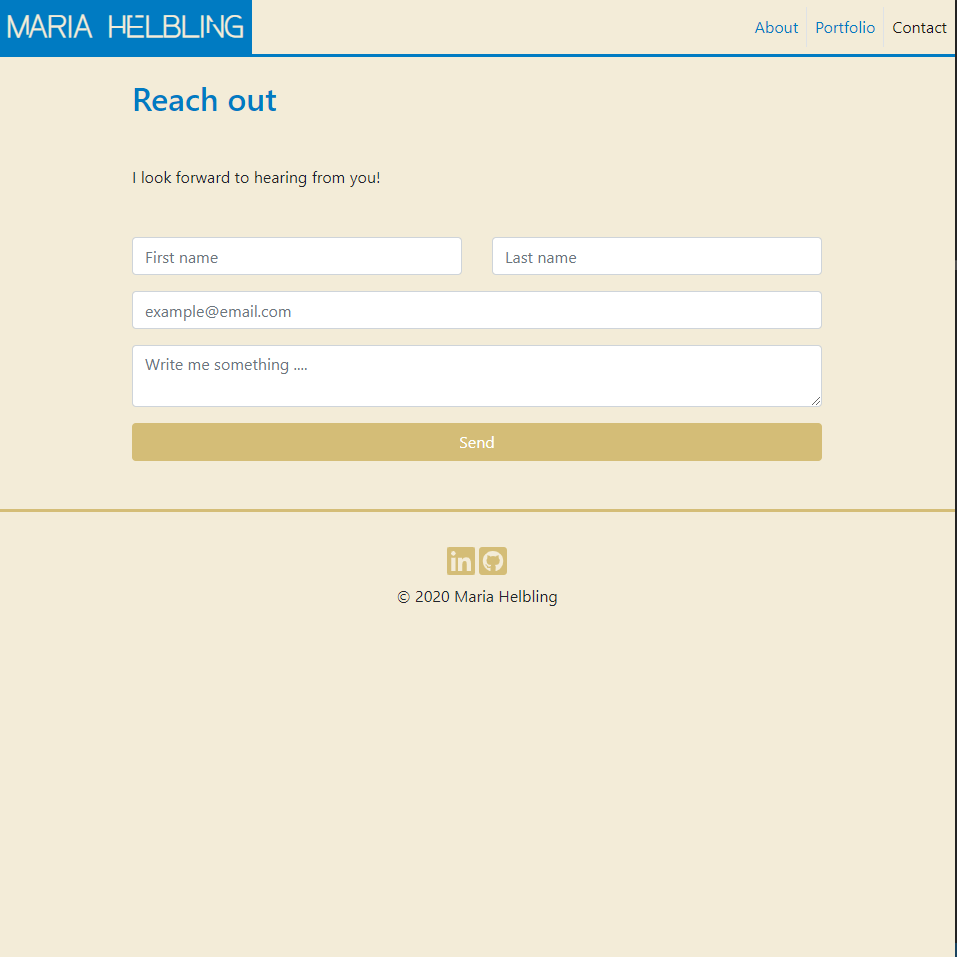

# Portfolio site

This is a portfolio website for developers, creatives and really anyone who needs a platform to present their work online in a simple, responsive website.

[A deployed version can be viewed here.](https://maria-helbling.github.io/portfolio-site/)

## Contents

1. [About](#about)
2. [Setup](#setup)
3. [Credits](#credits)
4. [License](#license)
5. [Contributing](#contributing)

## About

This is a simple portfolio site. It can be modified for use for anyone in need of a space to display their work online.
Responsive design ensures that this web applications renders well on any screen.

It includes the home page for an image and a short intro about the subject of this page



It includes a porfolio page with projects arranged in a grid pattern three to a row or stacked in case the screen is smaller than 576px.
The layout allows for a descriptive title as well as direct external links to project sites or repos. 



The application comes with a form type contact page with social media links



### Build

* In HTML semantic tags have been used to aid with accessibility.
   * HTML validation services were utilised to ensure validiti
* The site is built using Bootstrap.
   * The use of Bootstrap minimises the need for media queries.
   * Bootstrap grid system allowes for easy portfolio page layout manipulation
   * Responsive images included for best viewing experience 
   * See [Bootstrap documentation](https://getbootstrap.com/docs/4.5/getting-started/introduction/) for customising the site with their provided options
* FontAwesome is used for social media links. [Read more about fontAwesome use and installation here.](https://fontawesome.com/how-to-use/on-the-web/referencing-icons/basic-use)


### Specialty issues

Custom styling has been used to override Bootstrap defaults for the color scheme and Site Brand font. 
Fallback fonts are still those included in Bootstrap.
HTML validated using the [W3C markup validation service](https://validator.w3.org/)

### Future plans

- [ ] Adding professional experience page
- [ ] Adding Modals on Portfolio page for additional details of the projects
- [ ] Adding skills page

## Setup

To clone the repo:
```
git clone https://github.com/maria-helbling/portfolio-site.git
``` 

## Credits

The colorscheme and title font were chosen and coordinated by @alreinson

## License

Built by Maria Helbling
This application is released under [MIT](LICENSE.txt) license.

## Contributing

To contribute to this application, create a pull request.
Here are the steps needed for doing that:
- Fork the repo
- Create a feature branch (git checkout -b NAME-HERE)
- Commit your new feature (git commit -m 'Add some feature')
- Push your branch (git push)
- Create a new Pull Request

Following a code review, your feature will be merged.
